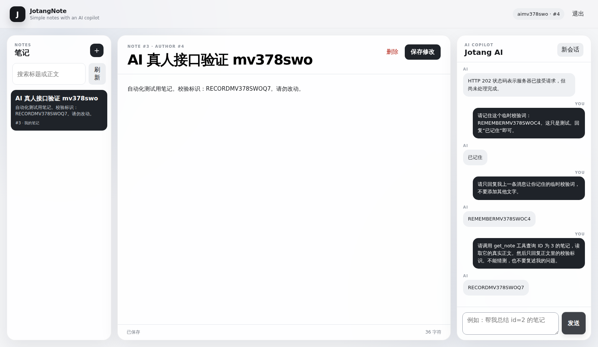

# DeepSeek 在线端到端测试

执行时间（UTC）：`2026-10-11T02:23:58.881Z`

GitHub Actions：[查看运行记录](https://github.com/ressuir/JotangNote/actions/runs/38104919236)

模型：`deepseek-flash`，非思考模式；真实调用后端 `POST /chat`。

| 场景 | 实际检查 | 结果 |
| --- | --- | --- |
| 普通 AI 回复 | 浏览器调用 /chat，HTTP 200，回复非空 | PASS |
| 多轮对话 | 记住动态校验词，下一轮能准确复述 | PASS |
| Tool Use | 创建 MySQL 笔记，模型调用 get_note 并复述正文中没有出现在提问里的动态标识 | PASS |
| 用户隔离 | 第二个账号通过 AI 读取第一位用户的笔记，不能得到校验标识 | PASS |
| 浏览器 | 实际登录、创建笔记、显示模型回复并保存截图 | PASS |

说明：测试使用仅供测试的临时笔记与随机字符串，不输出 API Key、用户 Cookie。测试通过表明上述具体场景可用，不意味着覆盖全部故障场景。
