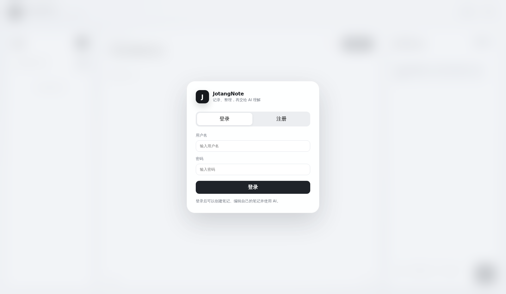
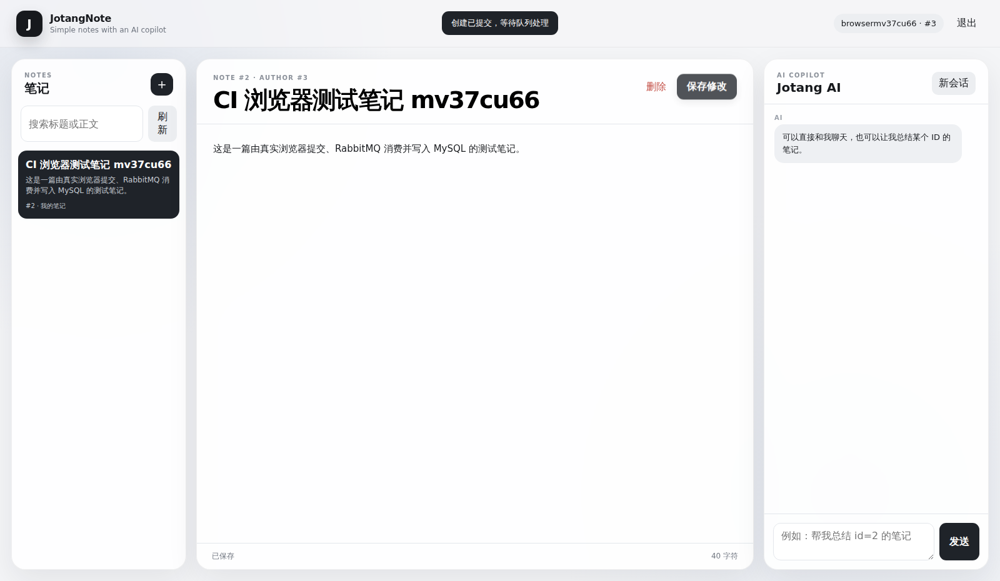
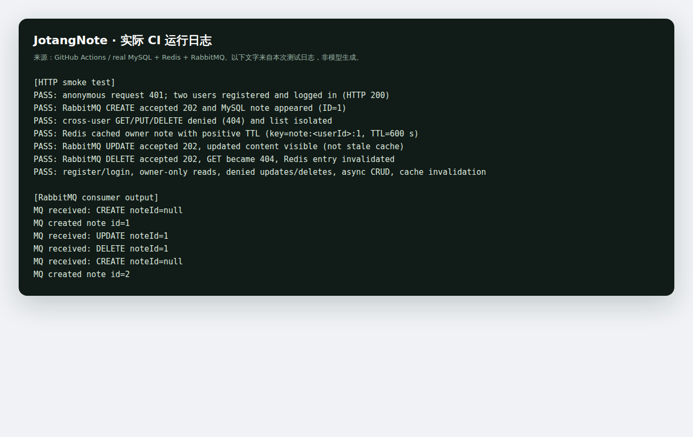

# 后端入门篇

这部分是在启蒙篇的 Spring Boot 项目上继续完成 JotangNote 后端。代码在 `src/main/java/com/example/JotangNote`，建表文件在 `sql/schema.sql`。

## Part 1 MySQL

### 表和笔记接口

创建了两张表：

- `users`：id、username、password_hash、created_at。
- `notes`：id、author_id、title、content、created_at、updated_at。

笔记正文目前用 MySQL 的 `LONGTEXT`。表之间用 `author_id` 关联，`Note` / `User` 是对应的 Java 实体，`NoteMapper` / `UserMapper` 继承 MyBatis-Plus 的 `BaseMapper`。

主要接口是 `POST /api/notes`、`GET /api/notes/{id}`、`PUT /api/notes/{id}`、`DELETE /api/notes/{id}`。还有 `GET /api/notes`，供网页展示当前用户的笔记列表。

### 注册、登录、权限

注册走 `AuthController.register()`，用户名查重后把密码用 BCrypt 处理，保存的是哈希，不是明文。

登录时根据用户名查询用户，再用 BCrypt 校验密码。成功后把用户 ID 放进 HTTP Session。前端通过浏览器 Cookie 保持这个 Session。

创建笔记时，后端从 Session 取 `userId`，不能让用户在请求里随意指定 `authorId`。读取、修改或删除时会调用 `NoteAccessService.findOwned()`。如果笔记不是当前用户的，返回 404，不提供别人的笔记内容。

注册现在会校验用户名长度（2～32 字符）、密码长度（8～72 UTF-8 字节）。

### Part 1 测试

浏览器注册、登录后创建笔记，可以在列表里看到它。自动化 HTTP 测试还会建立两个账号：用户 A 创建笔记；用户 B 无法读取、修改、删除它，列表中也不能出现它。





> 上述图片由 GitHub Actions 在真实运行的 Spring Boot 和数据库上用 Chromium 自动截图，只有对应 CI 运行完成后才会生成到仓库。

## Part 2 Redis

单篇笔记查询先尝试 Redis。缓存键现在是 `note:<userId>:<noteId>`，避免不同用户共用同一个缓存键。

查不到缓存时才去 MySQL，查到了再把笔记序列化成 JSON 放回 Redis，过期时间 10 分钟。用户修改或删除笔记后，RabbitMQ 消费者在数据库操作结束时删除对应缓存键。

我之前遇到过 MySQL 账号环境变量没有传进 Spring Boot 的问题，导致第一次真正查数据库时 500。它和 Redis 本身是否命中没有关系。

现在还补了一个降级：如果 Redis 不可用，读取功能仍可以经权限检查去 MySQL 查询。

### Part 2 测试

测试脚本连续读取同一篇笔记，然后用 `redis-cli` 读取对应键，并检查 JSON 里的笔记 ID 和 TTL。修改笔记后重新读取，确保返回新正文；删除后检查缓存键不存在。

## Part 3 RabbitMQ

`NoteController` 接收创建、修改、删除请求，构造 `NoteOperationMessage`，使用 `RabbitTemplate.convertAndSend()` 发到 `note.operations` 队列。

接口返回 `202 Accepted`：表示操作已经入队，**不是数据库已经写完**。所以网页会轮询确认真正保存/删除完成。

`NoteOperationConsumer.handle()` 上有 `@RabbitListener`，收到消息后根据 `CREATE / UPDATE / DELETE` 分支执行对应的 MyBatis-Plus 操作。修改和删除时消费者会再次确认作者身份，结束后删除 Redis 缓存。

### Part 3 测试

测试里先 POST 新笔记等待它出现在 MySQL，再 PUT，最后 DELETE，并检查实际查询结果。HTTP 的 202 和消费者日志需要结合起来看，不能把“入队成功”当成“落库成功”。



### 一次性复查

准备 MySQL、Redis、RabbitMQ，按 README 启动服务后可以执行：

```bash
bash scripts/smoke-test.sh
```

这个脚本会用随机测试账号跑完注册/登录、笔记权限、Redis 实际键值和 TTL、RabbitMQ CRUD。需要本机有 `curl`、`jq`、`redis-cli`。

GitHub Actions 也会在 CI 中完成相同的真实集成测试，运行记录及截图可以从 [Actions](https://github.com/ressuir/JotangNote/actions) 查看；无需把真实的数据库账号、Session Cookie 或 API Key 写进仓库。

## 目前没有做的加分项

图片/附件上传、缓存击穿与穿透的专项方案、MQ 幂等性、死信队列和操作状态接口都没有完整实现。基础流程已经具备，但不把这些未做的部分写成已完成。
