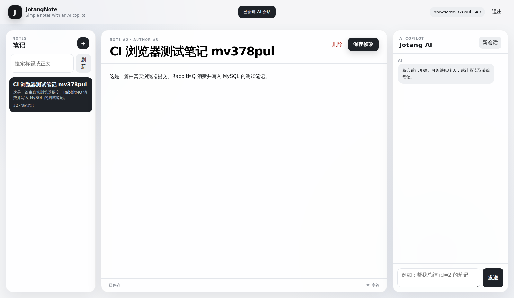

# 后端进阶篇

在入门篇已有 MySQL、Redis、RabbitMQ、用户 Session 和笔记接口上，继续加 AI 对话与前端。

## Part 1 AI API

后端接口是 `POST /chat`，请求体例如：

```json
{"message":"你好"}
```

`ChatController` 先检查登录 Session，再调用 `ChatService.chat()`。真正向模型 API 发 HTTP POST 的代码在 `ai/ModelClient.java`。

`ModelClient` 把消息组装成模型的 `messages` 格式，再带上模型名、工具定义和鉴权头，向 DeepSeek 的 Chat Completions API 发送请求。

服务端从环境变量 `DEEPSEEK_API_KEY` 读取密钥；仓库不存真实 Key。最终 `/chat` 只把 `reply` 返回前端。

### Part 1 测试

普通 API 测试应该能获得自然语言回复。**目前仓库没有可以独立核实的真实 DeepSeek API 成功调用记录，因此不把它标记为已实测通过。** 不依赖外部 Key 的会话与工具权限逻辑有自动化单元测试。

## Part 2 会话管理

模型 API 不会自动保存上一次请求的内容。要让第二句话理解第一句话，需要每次把历史 `messages` 一起发过去。

`ChatService` 用 `ConcurrentHashMap` 按会话 ID 保存 `List<ChatMessage>`。会话 ID 根据当前登录用户和 HTTP Session 生成，每次先追加用户消息，再调用模型，最后追加模型回复。

同一个会话的历史列表加锁，避免多个请求同时修改。调用 `DELETE /chat` 可以清空当前会话，相当于网页上的“新会话”。

这些历史目前只在 Java 内存里，重启就没了。没有做 Redis/MySQL 会话持久化。

### Part 2 测试

测试方法是同一会话连续问两句，例如先告知一个颜色，再问刚才的颜色。要验证的是后端发送给模型的第二次请求确实包括前一轮消息，而不只是模型碰巧回答正确。

目前源码实现了这个保存和重发流程；真实远程多轮回答的运行证据待验证。

## Part 3 Tool Use

这部分让模型可以请求查询笔记，但**模型不会直接运行 Java 或连接 MySQL**。

`ChatService.tools()` 告诉模型存在一个 `get_note` 工具，参数是 `noteId`。模型决定调用时会返回 `tool_calls`。`ModelClient` 解析出工具名称、参数、调用 ID，`ChatService.executeTool()` 再根据名称分发到 `getNote()`。

Java 解析参数后执行 `NoteAccessService.findOwned(noteId, userId)`。它会验证笔记属于当前登录用户。即使模型要求读取其他人的笔记，也不应该得到正文。

最重要的是，模型提出的 `assistant tool_calls` 消息和 Java 返回的 `tool` 消息都加入会话历史，再次调用模型，让它根据查到的内容生成最终答复。用户只能看到最终回答，不会直接看到中间 JSON。

为避免不断循环，单轮最多处理 5 次工具调用。

### Part 3 测试

`ChatServiceTest` 通过模拟模型返回 `get_note({"noteId":42})`，检查查询时确实使用当前用户 ID。它验证的是代码分发和权限，不是 DeepSeek 真实决定发起工具调用的行为。

## Part 4 网页前端

网页是 Spring Boot 的静态资源，位于：

- `src/main/resources/static/index.html`
- `src/main/resources/static/styles.css`
- `src/main/resources/static/app.js`

浏览器打开 `http://localhost:8080/`。注册/登录后可以创建、查看、编辑和删除自己的笔记，还可以使用右侧 AI 聊天框并新建 AI 会话。

前端通过 `fetch` 调现有 HTTP API，Cookie 保持 Session。笔记写入是异步的，因此前端收到 202 以后还会查询列表确认实际更新。

### Part 4 测试

GitHub Actions 使用真正的无头 Chromium 打开首页，注册新账号、登录、创建笔记，等消息队列写入后再确认笔记出现在列表，并截取页面。




> 第三张只证明 AI 界面和“新会话”按钮显示正常，不代表真实的 DeepSeek 调用已经成功。自动化浏览器测试不会消耗 AI 额度。

## 实际运行与剩余限制

- 仓库 CI 已有真实 MySQL、Redis、RabbitMQ HTTP 冒烟测试成功记录。最新版本的自动化记录见 [GitHub Actions](https://github.com/ressuir/JotangNote/actions)。
- AI 模型真实调用、多轮记忆和由 DeepSeek 自主发起的工具调用仍需真实 API 端到端测试记录。
- 未实现会话持久化、多个 AI 对话历史列表、文件附件、Docker 部署等加分功能。
